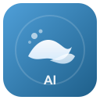

# PacificOceanAI

<div align="center">



**AI-Powered Writing Assistant for Overleaf LaTeX Editor**

[](https://www.gnu.org/licenses/agpl-3.0)
[](https://github.com/BigCatNotFat/PacificOceanAI)
[](https://www.typescriptlang.org/)
[](https://reactjs.org/)

[English](#english) | [中文](#中文)

</div>

---

## English

### 🌟 Features

- **🤖 Multi-Model AI Support**: Compatible with OpenAI, Anthropic Claude, Google Gemini, and OpenAI-compatible APIs
- **✍️ Smart Writing Assistance**: 
  - Improve writing quality and clarity
  - Fix grammar and spelling errors
  - Translate between languages
  - Expand or shorten text
  - Custom text actions
- **💬 Intelligent Chat**: Context-aware conversations about your LaTeX document
- **🔧 Function Calling**: AI can directly interact with your document through tools
- **📚 Literature Management**: Search and cite academic papers with CrossRef integration
- **🎨 Modern UI**: Beautiful, responsive sidebar interface
- **🔒 Privacy-First**: All data stored locally, no external servers
- **🌐 OAuth Support**: Use ChatGPT subscription without API keys

### 📦 Installation

#### From Source

1. **Clone the repository**
   ```bash
   git clone https://github.com/yourusername/pacific-ocean-ai.git
   cd pacific-ocean-ai
   ```

2. **Install dependencies**
   ```bash
   npm install
   ```

3. **Build the extension**
   ```bash
   npm run build
   ```

4. **Load in Chrome/Edge**
   - Open `chrome://extensions/` (or `edge://extensions/`)
   - Enable "Developer mode"
   - Click "Load unpacked"
   - Select the `dist` folder

### 🚀 Quick Start

1. **Open Overleaf**: Navigate to any Overleaf project
2. **Configure API**: Click the extension icon → Settings → Add your API key
3. **Start Using**: Select text in the editor and use the AI assistant

### ⚙️ Configuration

#### Supported AI Providers

- **OpenAI**: GPT-4, GPT-4 Turbo, GPT-3.5
- **Anthropic**: Claude 3.5 Sonnet, Claude 3 Opus/Haiku
- **Google**: Gemini 1.5 Pro/Flash, Gemini 2.0 Flash
- **OpenAI-Compatible**: Any API following OpenAI's format
- **ChatGPT OAuth**: Use your ChatGPT subscription (no API key needed)

#### Adding a Model

1. Open extension settings
2. Click "Add Model"
3. Enter model details:
   - Name: Display name
   - Model ID: API model identifier
   - Provider: Select provider type
   - API Key: Your API key
   - Base URL: (Optional) Custom API endpoint

### 🛠️ Development

```bash
# Install dependencies
npm install

# Development mode with hot reload
npm run dev

# Build for production
npm run build

# Build bridge module
npm run build:bridge

# Build everything
npm run build:all

# Pack extension
npm run pack
```

### 📁 Project Structure

```
pacific-ocean-ai/
├── src/
│   ├── base/              # Base utilities
│   ├── extension/         # Extension entry points
│   │   ├── background/    # Service worker
│   │   ├── content/       # Content script
│   │   ├── options/       # Settings page
│   │   └── popup/         # Popup UI
│   ├── platform/          # Platform abstractions
│   ├── services/          # Core services
│   │   ├── agent/         # AI agent system
│   │   ├── editor/        # Overleaf integration
│   │   ├── llm/           # LLM providers
│   │   └── literature/    # Literature search
│   ├── workbench/         # UI components
│   └── utils/             # Utilities
├── public/                # Static assets
├── scripts/               # Build scripts
└── dist/                  # Build output
```

### 🏗️ Architecture

PacificOceanAI uses a clean, modular architecture:

- **Dependency Injection**: Service-based architecture with DI container
- **Multi-Provider Support**: Unified interface for different AI providers
- **Tool System**: Extensible function calling framework
- **Bridge Pattern**: Safe communication with Overleaf editor
- **Stream Processing**: Real-time AI response streaming

### 🤝 Contributing

Contributions are welcome! Please read our [Contributing Guide](CONTRIBUTING.md) first.

1. Fork the repository
2. Create your feature branch (`git checkout -b feature/amazing-feature`)
3. Commit your changes (`git commit -m 'Add some amazing feature'`)
4. Push to the branch (`git push origin feature/amazing-feature`)
5. Open a Pull Request

### 📄 License

This project is licensed under the **GNU Affero General Public License v3.0 (AGPL-3.0)** - see the [LICENSE](LICENSE) file for details. Any modified version must also be open-sourced under the same license, including when used as a network service.

### 🙏 Acknowledgments

- [Overleaf](https://www.overleaf.com/) - Online LaTeX editor
- [OpenAI](https://openai.com/) - GPT models
- [Anthropic](https://www.anthropic.com/) - Claude models
- [Google](https://deepmind.google/) - Gemini models
- [React](https://reactjs.org/) - UI framework
- [Vite](https://vitejs.dev/) - Build tool

### 📞 Support

- 🐛 [Report a Bug](https://github.com/yourusername/pacific-ocean-ai/issues)
- 💡 [Request a Feature](https://github.com/yourusername/pacific-ocean-ai/issues)
- 📖 [Documentation](https://github.com/yourusername/pacific-ocean-ai/wiki)

### 🔒 Privacy

We take your privacy seriously. Read our [Privacy Policy](PRIVACY.md) to learn how we handle your data.

**Key Points:**
- ✅ All data stored locally on your device
- ✅ No external servers or analytics
- ✅ You control your API keys
- ✅ Open source and transparent

---

## 中文

### 🌟 功能特性

- **🤖 多模型支持**: 兼容 OpenAI、Anthropic Claude、Google Gemini 及 OpenAI 兼容 API
- **✍️ 智能写作辅助**: 
  - 改进写作质量和清晰度
  - 修正语法和拼写错误
  - 多语言翻译
  - 扩展或缩短文本
  - 自定义文本操作
- **💬 智能对话**: 基于 LaTeX 文档的上下文对话
- **🔧 函数调用**: AI 可以通过工具直接与文档交互
- **📚 文献管理**: 通过 CrossRef 搜索和引用学术论文
- **🎨 现代化界面**: 美观、响应式的侧边栏界面
- **🔒 隐私优先**: 所有数据本地存储，无外部服务器
- **🌐 OAuth 支持**: 使用 ChatGPT 订阅，无需 API 密钥

### 📦 安装

#### 从源码安装

1. **克隆仓库**
   ```bash
   git clone https://github.com/yourusername/pacific-ocean-ai.git
   cd pacific-ocean-ai
   ```

2. **安装依赖**
   ```bash
   npm install
   ```

3. **构建扩展**
   ```bash
   npm run build
   ```

4. **在 Chrome/Edge 中加载**
   - 打开 `chrome://extensions/`（或 `edge://extensions/`）
   - 启用"开发者模式"
   - 点击"加载已解压的扩展程序"
   - 选择 `dist` 文件夹

### 🚀 快速开始

1. **打开 Overleaf**: 导航到任意 Overleaf 项目
2. **配置 API**: 点击扩展图标 → 设置 → 添加你的 API 密钥
3. **开始使用**: 在编辑器中选择文本并使用 AI 助手

### ⚙️ 配置

#### 支持的 AI 提供商

- **OpenAI**: GPT-4, GPT-4 Turbo, GPT-3.5
- **Anthropic**: Claude 3.5 Sonnet, Claude 3 Opus/Haiku
- **Google**: Gemini 1.5 Pro/Flash, Gemini 2.0 Flash
- **OpenAI 兼容**: 任何遵循 OpenAI 格式的 API
- **ChatGPT OAuth**: 使用你的 ChatGPT 订阅（无需 API 密钥）

#### 添加模型

1. 打开扩展设置
2. 点击"添加模型"
3. 输入模型详情：
   - 名称：显示名称
   - 模型 ID：API 模型标识符
   - 提供商：选择提供商类型
   - API 密钥：你的 API 密钥
   - Base URL：（可选）自定义 API 端点

### 🛠️ 开发

```bash
# 安装依赖
npm install

# 开发模式（热重载）
npm run dev

# 生产构建
npm run build

# 构建桥接模块
npm run build:bridge

# 构建所有内容
npm run build:all

# 打包扩展
npm run pack
```

### 📁 项目结构

```
pacific-ocean-ai/
├── src/
│   ├── base/              # 基础工具
│   ├── extension/         # 扩展入口点
│   │   ├── background/    # Service Worker
│   │   ├── content/       # Content Script
│   │   ├── options/       # 设置页面
│   │   └── popup/         # 弹出窗口
│   ├── platform/          # 平台抽象
│   ├── services/          # 核心服务
│   │   ├── agent/         # AI 代理系统
│   │   ├── editor/        # Overleaf 集成
│   │   ├── llm/           # LLM 提供商
│   │   └── literature/    # 文献搜索
│   ├── workbench/         # UI 组件
│   └── utils/             # 工具函数
├── public/                # 静态资源
├── scripts/               # 构建脚本
└── dist/                  # 构建输出
```

### 🏗️ 架构

PacificOceanAI 采用清晰的模块化架构：

- **依赖注入**: 基于服务的架构与 DI 容器
- **多提供商支持**: 不同 AI 提供商的统一接口
- **工具系统**: 可扩展的函数调用框架
- **桥接模式**: 与 Overleaf 编辑器的安全通信
- **流式处理**: 实时 AI 响应流

### 🤝 贡献

欢迎贡献！请先阅读我们的[贡献指南](CONTRIBUTING.md)。

1. Fork 本仓库
2. 创建你的特性分支 (`git checkout -b feature/amazing-feature`)
3. 提交你的更改 (`git commit -m 'Add some amazing feature'`)
4. 推送到分支 (`git push origin feature/amazing-feature`)
5. 开启一个 Pull Request

### 📄 许可证

本项目采用 **GNU Affero 通用公共许可证 v3.0 (AGPL-3.0)** - 详见 [LICENSE](LICENSE) 文件。任何修改版本必须以相同许可证开源，包括作为网络服务使用时。

### 🙏 致谢

- [Overleaf](https://www.overleaf.com/) - 在线 LaTeX 编辑器
- [OpenAI](https://openai.com/) - GPT 模型
- [Anthropic](https://www.anthropic.com/) - Claude 模型
- [Google](https://deepmind.google/) - Gemini 模型
- [React](https://reactjs.org/) - UI 框架
- [Vite](https://vitejs.dev/) - 构建工具

### 📞 支持

- 🐛 [报告 Bug](https://github.com/yourusername/pacific-ocean-ai/issues)
- 💡 [请求功能](https://github.com/yourusername/pacific-ocean-ai/issues)
- 📖 [文档](https://github.com/yourusername/pacific-ocean-ai/wiki)

### 🔒 隐私

我们非常重视你的隐私。阅读我们的[隐私政策](PRIVACY.md)了解我们如何处理你的数据。

**要点：**
- ✅ 所有数据本地存储在你的设备上
- ✅ 无外部服务器或分析
- ✅ 你控制你的 API 密钥
- ✅ 开源且透明

---

<div align="center">

Made with ❤️ by the PacificOceanAI Team

[⬆ Back to Top](#pacificoceanai)

</div>
